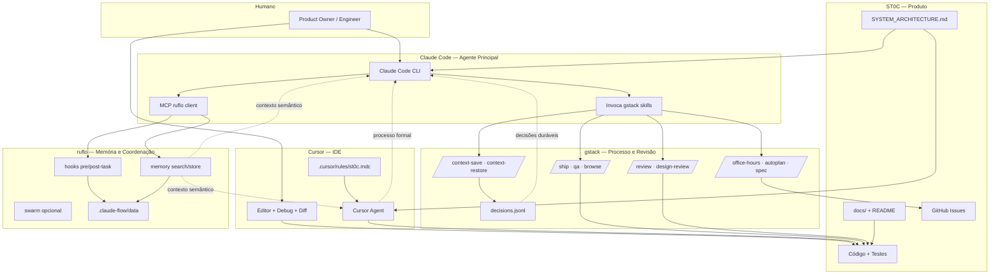

# SYSTEM_ARCHITECTURE.md — ST0C

Arquitetura operacional do projeto ST0C. Define **quem faz o quê**, **onde vive cada
fonte de verdade** e **como as ferramentas se coordenam** — sem duplicar o que gstack
ou ruflo já resolvem.

> **Leitura obrigatória** para qualquer agente (Claude Code, Cursor) antes de processos
> formais de planejamento, revisão ou ship.

---

## 1. Visão geral

| Camada | Papel | Localização |
|--------|-------|-------------|
| **ST0C** | Produto — código, testes, docs versionados | Este repositório |
| **Cursor** | Ambiente de desenvolvimento (IDE + agent) | Editor local |
| **Claude Code** | Agente principal de engenharia | CLI + terminal |
| **gstack** | Processo e revisão (plan → review → QA → ship) | `~/.claude/skills/gstack` |
| **ruflo** | Memória semântica e coordenação | `.claude-flow/` + MCP |

**Princípio central:** ST0C é o produto. gstack governa *como* trabalhamos. ruflo
governa *o que lembramos* entre sessões. Cursor e Claude Code executam o trabalho.

---

## 2. Diagrama de interação



---

## 3. Estrutura do repositório ST0C

```
ST0C/
├── SYSTEM_ARCHITECTURE.md   # Este documento — arquitetura operacional
├── CLAUDE.md                # Regras + skill routing para agentes
├── README.md                # Visão do produto
├── .cursor/rules/st0c.mdc   # Regras permanentes no Cursor
├── .claude-flow/            # Runtime ruflo (memória, config) — gerenciado pelo ruflo
├── docs/                    # Documentação versionada do produto
│   ├── product/             # Visão, requisitos, roadmap
│   ├── architecture/        # Diagramas e visão técnica
│   └── adr/                 # Architecture Decision Records (decisões maiores)
└── src/                     # Código-fonte (quando existir)
```

**Não versionar / não criar no ST0C:**

- Vendoring de gstack (`.agents/skills/gstack/`) — usar install em `~/.claude/skills/gstack`
- Cópia de agentes ruflo de outros projetos (ex.: `c.com/.claude/agents/`)
- Frameworks de governança paralelos ao gstack
- gbrain por padrão (opcional; ver §9)

---

## 4. Responsabilidades por ferramenta

### ST0C (produto)

- Código-fonte, testes, CI/CD, configs de deploy
- Documentação versionada em `docs/`
- Issues e milestones no GitHub
- ADRs para decisões arquiteturais **significativas** (commit no repo)

### Claude Code (agente principal de engenharia)

- Invocar skills gstack para processo formal
- Operações de terminal, git, build, test
- Conectar ao MCP ruflo para memória e hooks
- Implementação após plano aprovado
- Registrar decisões duráveis via gstack (`gstack-decision-log`)

### Cursor (ambiente de desenvolvimento)

- Edição, navegação, debug, diff visual
- Agent mode para iteração rápida no IDE
- Seguir `.cursor/rules/st0c.mdc` e este documento
- Delegar processo formal (review, ship, autoplan) ao Claude Code quando aplicável
- Pode usar skills gstack disponíveis para tarefas pontuais

### gstack (processo e revisão)

| Fase | Skills |
|------|--------|
| Descoberta | `/office-hours` |
| Estratégia | `/plan-ceo-review` |
| Arquitetura | `/plan-eng-review` |
| Design | `/plan-design-review`, `/design-consultation` |
| Pipeline completo | `/autoplan` |
| Ticket | `/spec` |
| Debug | `/investigate` |
| Revisão | `/review`, `/design-review`, `/devex-review` |
| QA | `/qa`, `/qa-only`, `/browse` |
| Ship | `/ship`, `/land-and-deploy` |
| Contexto de sessão | `/context-save`, `/context-restore` |
| Documentação | `/document-generate`, `/document-release` |

**Memória gstack (não confundir com ruflo):**

- Decisões: `~/.gstack/projects/st0c/decisions.jsonl`
- Learnings de processo: `~/.gstack/projects/st0c/learnings.jsonl`
- Handoff de sessão: `/context-save` + `/context-restore`

### ruflo (memória e coordenação)

- Memória semântica vetorial (`.claude-flow/data/`)
- Hooks automáticos (pre-task, post-task)
- MCP server para ferramentas de coordenação
- Swarm multi-agente — **opcional**, usar só quando necessário
- Daemon/workers em background — **off por padrão** (consome tokens)

---

## 5. Source of Truth

| Domínio | Source of Truth | Onde | Quem escreve |
|---------|-----------------|------|--------------|
| **Produto** | Visão + backlog | `README.md`, `docs/product/`, GitHub Issues | Humano + gstack `/spec` |
| **Arquitetura técnica** | ADRs + diagramas | `docs/architecture/`, `docs/adr/` | gstack `/plan-eng-review` → commit |
| **Decisões operacionais** | Log append-only | `~/.gstack/projects/st0c/decisions.jsonl` | gstack `gstack-decision-log` |
| **Memória semântica** | Padrões e contexto cross-session | `.claude-flow/data/` (ruflo) | ruflo hooks + `memory store` |
| **Handoff de sessão** | Estado de trabalho em curso | gstack context files | `/context-save` |
| **Tarefas** | Issues rastreáveis | GitHub Issues | gstack `/spec` cria; humano prioriza |
| **Processo operacional** | Como usar as ferramentas | `SYSTEM_ARCHITECTURE.md` | Mantido no repo ST0C |

### Fronteiras de memória (anti-duplicação)

| Camada | Ferramenta | Uso |
|--------|------------|-----|
| **Sessão** | gstack context-save/restore | Retomar trabalho da última sessão |
| **Semântica** | ruflo memory | Buscar padrões, contexto histórico, aprendizados |
| **Decisões** | gstack decisions.jsonl | Decisões duráveis com rationale (audit trail) |
| **Wiki (opcional)** | gbrain | Desligado por padrão — ativar só se necessário |

---

## 6. Fluxo de trabalho diário

```
┌─────────────────────────────────────────────────────────────────┐
│ INÍCIO DO DIA                                                   │
├─────────────────────────────────────────────────────────────────┤
│ 1. ruflo memory search --query "<tema do dia>"                  │
│ 2. gstack /context-restore (se sessão anterior)                 │
│ 3. gstack-decision-search --recent 5 (decisões ativas)            │
└─────────────────────────────────────────────────────────────────┘
                              ↓
┌─────────────────────────────────────────────────────────────────┐
│ TRABALHO                                                        │
├─────────────────────────────────────────────────────────────────┤
│ • Cursor: edição, debug, iteração rápida                        │
│ • Claude Code: terminal, skills gstack, implementação complexa  │
│ • ruflo hooks pre-task antes de tarefas grandes                 │
└─────────────────────────────────────────────────────────────────┘
                              ↓
┌─────────────────────────────────────────────────────────────────┐
│ FIM DO DIA / PAUSA                                              │
├─────────────────────────────────────────────────────────────────┤
│ 1. gstack /context-save                                         │
│ 2. ruflo hooks post-task (automático se hooks ativos)           │
│ 3. gstack-decision-log (se houve decisão durável)               │
└─────────────────────────────────────────────────────────────────┘
```

---

## 7. Processo de planejamento

| Cenário | Fluxo |
|---------|-------|
| **Feature nova** | `/office-hours` → `/autoplan` → `/spec` (GitHub Issue) → implementar |
| **Bug** | `/investigate` → fix → `/review` |
| **Refactor** | `/plan-eng-review` → implementar → `/review` |
| **Mudança de escopo** | `/plan-ceo-review` → atualizar Issue → `/autoplan` se necessário |
| **Polish visual** | `/design-consultation` → implementar → `/design-review` |

**Regra:** plano aprovado antes de código (ver `CLAUDE.md`).

---

## 8. Processo de implementação

| Tarefa | Ferramenta preferida |
|--------|---------------------|
| Edição de arquivos, refator local | Cursor |
| Comandos de build/test, git complexo | Claude Code |
| Mudanças multi-arquivo com processo formal | Claude Code + gstack |
| Exploração de codebase | Cursor Agent ou Claude Code |

**Pipeline padrão para feature:**

```
Issue → branch → implementar (Cursor/Claude Code) → testes locais → /review → /qa (se UI) → /ship
```

---

## 9. Processo de revisão

| Etapa | Obrigatório | Ferramenta |
|-------|-------------|------------|
| Code review pre-merge | **Sim** | gstack `/review` |
| Design review | Se UI/UX | gstack `/design-review` |
| DevEx review | Se tooling/CLI | gstack `/devex-review` |
| QA funcional | Se comportamento visível | gstack `/qa` + `/browse` |
| Audit em background | Opcional | ruflo worker `audit` (daemon off por padrão) |

**Nunca fazer push/PR direto** quando o usuário pedir ship — usar gstack `/ship`.

---

## 10. Processo de documentação

| Tipo | Onde | Como |
|------|------|------|
| Visão do produto | `README.md`, `docs/product/` | Manual + commits |
| Arquitetura | `docs/architecture/` | Após `/plan-eng-review` |
| ADRs (decisões grandes) | `docs/adr/` | Template ADR no repo |
| Release notes | CHANGELOG / GitHub Release | gstack `/document-release` |
| Docs geradas | `docs/` | gstack `/document-generate` |

**Não duplicar:** referenciar docs oficiais do gstack e ruflo em vez de copiá-los.

---

## 11. Processo de memória e contexto

### Início de sessão

```bash
npx ruflo@latest memory search --query "<keywords>"
# gstack: /context-restore
# gstack: bin/gstack-decision-search --recent 5
```

### Durante o trabalho

- Decisão durável (arquitetura, escopo, vendor): `gstack-decision-log`
- Padrão útil descoberto: ruflo `memory store` (via hooks ou MCP)
- Não logar decisões triviais — ver critério em gstack CLAUDE.md

### Fim de sessão

```bash
# gstack: /context-save
# ruflo hooks post-task (automático)
```

### gbrain (opcional, desligado por padrão)

Ativar apenas se precisar de wiki semântica separada da memória ruflo:

```bash
# No Claude Code, dentro do ST0C:
# /setup-gbrain → /sync-gbrain
```

---

## 12. Setup das ferramentas

### gstack (já instalado)

Local: `~/.claude/skills/gstack`

Não vendoring no ST0C. Não alterar `gstack-main/` no workspace.

Documentação: [gstack README](https://github.com/garrytan/gstack)

### ruflo (inicializado neste repo)

```bash
cd ST0C
npx ruflo@latest init --minimal    # já executado
npx ruflo@latest init upgrade     # helpers + statusline — já executado
npx ruflo@latest memory init --backend hybrid   # já executado
npx ruflo@latest doctor --fix
claude mcp add ruflo -- npx -y ruflo@latest mcp start   # MCP no Claude Code (se ainda não configurado globalmente)
```

**Opcional (consome tokens):**

```bash
npx ruflo@latest daemon start       # workers em background; auto-stop 12h
npx ruflo@latest swarm init --topology hierarchical --max-agents 8
```

### Cursor

Regras em `.cursor/rules/st0c.mdc`. Skills gstack disponíveis via install global.

---

## 13. Sobreposições resolvidas

| Área | gstack | ruflo | Resolução |
|------|--------|-------|-----------|
| Memória | context-save, decisions.jsonl | memory search/store | Camadas distintas (§5) |
| Planejamento | /autoplan, reviews | planner agent | gstack = processo; ruflo = coordenação multi-agente |
| Revisão | /review | code-review-swarm | gstack = obrigatório pre-merge |
| Documentação | /document-generate | document worker | Repo = SoT; gstack gera; ruflo sync opcional |
| Tarefas | /spec → Issues | issue-tracker | GitHub Issues = SoT |

---

## 14. Referências externas

| Recurso | URL / path |
|---------|------------|
| gstack | `~/.claude/skills/gstack` · [github.com/garrytan/gstack](https://github.com/garrytan/gstack) |
| ruflo | [github.com/ruvnet/claude-flow](https://github.com/ruvnet/claude-flow) |
| ruflo config local | `.claude-flow/config.yaml` |
| gstack-main (referência) | `../gstack-main/` — **não modificar** |

---

## 15. Changelog deste documento

| Data | Mudança |
|------|---------|
| 2026-06-24 | Criação inicial — arquitetura operacional ST0C |
